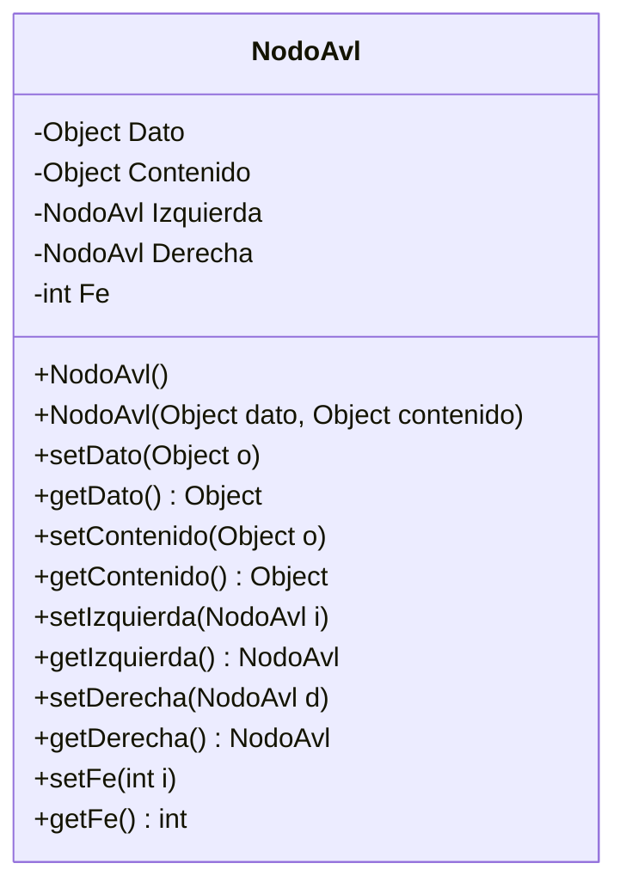
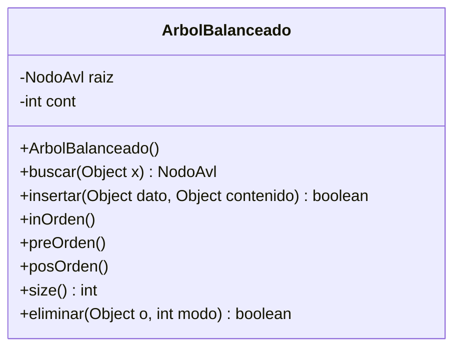
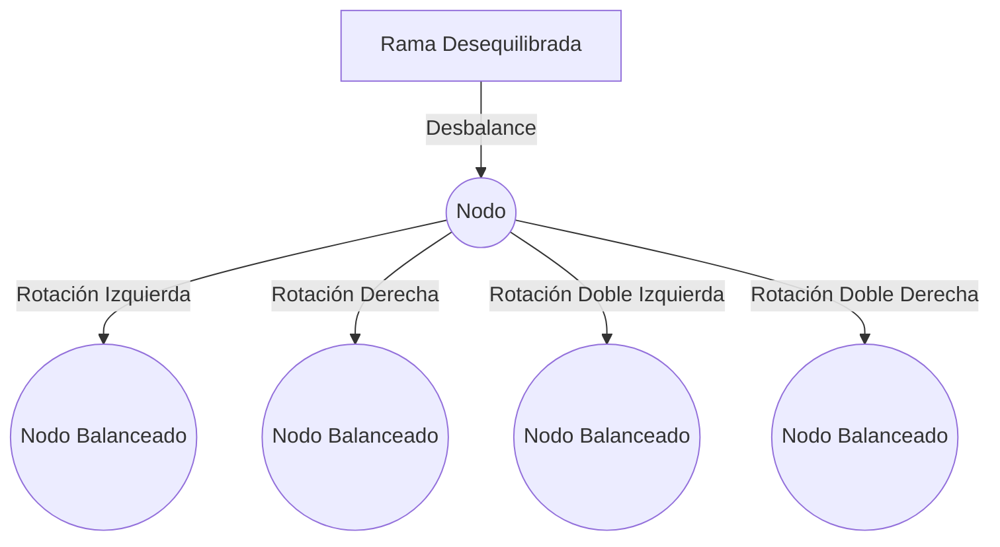
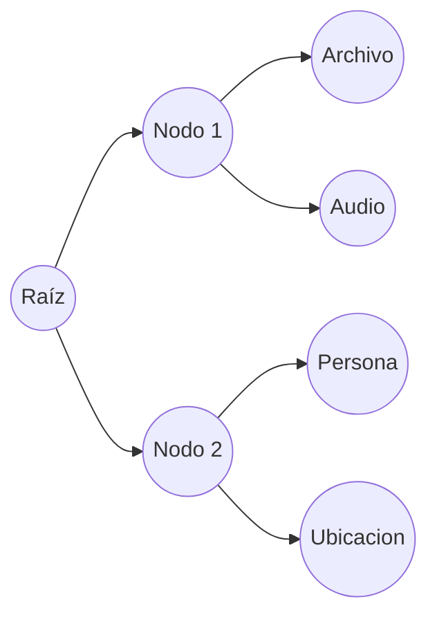

# Árbol Binario Balanceado Datos

## Introducción

El código proporcionado representa la implementación de un [Árbol Binario Balanceado AVL](https://github.com/jangelmm/doc-edd-avl-estandar) en Java, con una mejora significativa respecto a la estructura de los nodos: cada nodo puede almacenar un dato adicional denominado `Contenido`. Este cambio aumenta la flexibilidad del árbol, permitiéndole gestionar una variedad más amplia de datos.

---

### ¿Qué es un Árbol AVL?

Un Árbol AVL es un tipo de árbol binario de búsqueda autobalanceado, nombrado en honor a sus inventores, Adelson-Velsky y Landis. Se caracteriza por mantener su balance a través de rotaciones, lo que asegura que la altura del árbol se mantenga logarítmica con respecto al número de nodos, garantizando operaciones eficientes de búsqueda, inserción y eliminación.

---

## Explicación Detallada del Código

##### 1. **Clase `NodoAvl`**

La clase `NodoAvl` define la estructura de cada nodo en el árbol AVL. A diferencia de una implementación tradicional, este nodo incluye un atributo adicional llamado `Contenido`.

- **Atributos**:
  - `Dato`: Representa la clave del nodo, que se utiliza para organizar el árbol.
  - `Contenido`: Puede almacenar cualquier tipo de dato adicional (archivos, direcciones, cadenas de texto, imágenes, etc.).
  - `Izquierda` y `Derecha`: Referencias a los hijos izquierdo y derecho del nodo, respectivamente.
  - `Fe`: Factor de equilibrio, utilizado para mantener el árbol balanceado.

###### Diagrama del Nodo


##### 2. **Clase `ArbolBalanceado`**

La clase `ArbolBalanceado` gestiona las operaciones del árbol AVL, incluyendo la inserción, eliminación y los recorridos.

- **Atributos**:
  - `raiz`: Referencia a la raíz del árbol.
  - `cont`: Contador utilizado en la eliminación de nodos.

- **Métodos Clave**:
  - `insertar`: Inserta un nuevo nodo en el árbol, manteniendo el balance mediante rotaciones.
  - `eliminar`: Elimina un nodo del árbol y reequilibra si es necesario.
  - `buscar`: Busca un nodo específico basado en su dato.
  - `inOrden`, `preOrden`, `posOrden`: Métodos para recorrer el árbol en diferentes órdenes.

###### Diagrama del Árbol Balanceado


##### Inserción y Balanceo

Cuando se inserta un nuevo nodo, el árbol se ajusta automáticamente para mantener su balance. Esto se logra calculando el factor de equilibrio (`Fe`) de los nodos y realizando rotaciones (simples o dobles) cuando sea necesario.

###### Diagrama de Inserción y Rotaciones


---

#### Mejoras Comparado con Implementaciones Anteriores

La principal mejora de esta implementación respecto a versiones anteriores del árbol AVL es la capacidad de cada nodo para almacenar un contenido adicional, lo que le da una gran versatilidad y capacidad para manejar datos más complejos.

##### Beneficios del Atributo `Contenido`:
1. **Flexibilidad de Datos**: Permite almacenar cualquier tipo de objeto (archivos, direcciones, cadenas de texto, imágenes, etc.), lo que extiende el uso del árbol AVL más allá de simples valores numéricos o cadenas.
2. **Integración de Información**: Facilita la creación de estructuras de datos más complejas y ricas en información, mejorando la capacidad de modelado de datos.
3. **Acceso y Gestión Eficiente**: Al mantener los datos adicionales dentro del mismo nodo, se simplifica el acceso y la gestión de la información asociada a cada clave.

---

## Usos Posibles

El árbol AVL mejorado con el atributo `Contenido` se puede utilizar en una variedad de aplicaciones:

- **Sistemas de Archivos**: Almacenar rutas de archivos y sus contenidos.
- **Bases de Datos en Memoria**: Gestionar registros con múltiples campos de datos.
- **Índices de Documentos**: Almacenar palabras clave y sus contextos o ubicaciones.
- **Gestión de Imágenes**: Guardar imágenes junto con sus metadatos.
- **Sistemas de Información Geográfica (GIS)**: Almacenar coordenadas y datos asociados como nombres de lugares, descripciones, etc.

---

#### Potencial del Atributo `Contenido`

El atributo `Contenido` en los nodos de un árbol AVL representa un gran potencial para la gestión avanzada de datos. Este atributo permite que cada nodo del árbol pueda almacenar cualquier tipo de información adicional, convirtiendo al árbol en una estructura de datos polivalente.

##### Ejemplo de Usos del `Contenido`
- **Archivos**: Un nodo podría almacenar una clave que representa el nombre del archivo y el contenido que contiene los datos del archivo.
- **Direcciones**: En una aplicación de gestión de contactos, la clave podría ser el nombre de la persona y el contenido su dirección y otros detalles.
- **Strings**: Para un índice de texto, la clave podría ser una palabra y el contenido su frecuencia de aparición.
- **Imágenes**: La clave podría ser el identificador de una imagen y el contenido los datos binarios de la imagen.


A continuación, te proporciono ejemplos de clases que pueden ser usadas como el tipo `Object` en el campo `Contenido` de los nodos del árbol AVL. Estos ejemplos ilustran cómo el árbol puede almacenar una variedad de tipos de datos útiles.

### Clase Archivo

La clase `Archivo` puede representar cualquier tipo de archivo almacenado en el sistema.

```java
import java.io.File;

public class Archivo {
    private String nombre;
    private String ruta;
    private long tamanio;
    private String tipo;

    public Archivo(String nombre, String ruta, long tamanio, String tipo) {
        this.nombre = nombre;
        this.ruta = ruta;
        this.tamanio = tamanio;
        this.tipo = tipo;
    }

    public String getNombre() {
        return nombre;
    }

    public void setNombre(String nombre) {
        this.nombre = nombre;
    }

    public String getRuta() {
        return ruta;
    }

    public void setRuta(String ruta) {
        this.ruta = ruta;
    }

    public long getTamanio() {
        return tamanio;
    }

    public void setTamanio(long tamanio) {
        this.tamanio = tamanio;
    }

    public String getTipo() {
        return tipo;
    }

    public void setTipo(String tipo) {
        this.tipo = tipo;
    }

    @Override
    public String toString() {
        return "Archivo [nombre=" + nombre + ", ruta=" + ruta + ", tamanio=" + tamanio + " bytes, tipo=" + tipo + "]";
    }
}
```

### Clase Audio

La clase `Audio` puede representar archivos de audio con metadatos asociados.

```java
public class Audio {
    private String titulo;
    private String artista;
    private String album;
    private int duracion; // duración en segundos
    private String formato;

    public Audio(String titulo, String artista, String album, int duracion, String formato) {
        this.titulo = titulo;
        this.artista = artista;
        this.album = album;
        this.duracion = duracion;
        this.formato = formato;
    }

    public String getTitulo() {
        return titulo;
    }

    public void setTitulo(String titulo) {
        this.titulo = titulo;
    }

    public String getArtista() {
        return artista;
    }

    public void setArtista(String artista) {
        this.artista = artista;
    }

    public String getAlbum() {
        return album;
    }

    public void setAlbum(String album) {
        this.album = album;
    }

    public int getDuracion() {
        return duracion;
    }

    public void setDuracion(int duracion) {
        this.duracion = duracion;
    }

    public String getFormato() {
        return formato;
    }

    public void setFormato(String formato) {
        this.formato = formato;
    }

    @Override
    public String toString() {
        return "Audio [titulo=" + titulo + ", artista=" + artista + ", album=" + album + ", duracion=" + duracion + " segundos, formato=" + formato + "]";
    }
}
```

### Clase Ruta

La clase `Ruta` puede representar una ruta geográfica con una lista de ubicaciones.

```java
import java.util.List;

public class Ruta {
    private String nombre;
    private List<Ubicacion> ubicaciones;

    public Ruta(String nombre, List<Ubicacion> ubicaciones) {
        this.nombre = nombre;
        this.ubicaciones = ubicaciones;
    }

    public String getNombre() {
        return nombre;
    }

    public void setNombre(String nombre) {
        this.nombre = nombre;
    }

    public List<Ubicacion> getUbicaciones() {
        return ubicaciones;
    }

    public void setUbicaciones(List<Ubicacion> ubicaciones) {
        this.ubicaciones = ubicaciones;
    }

    @Override
    public String toString() {
        return "Ruta [nombre=" + nombre + ", ubicaciones=" + ubicaciones + "]";
    }
}
```

### Clase Persona

La clase `Persona` puede representar información de una persona.

```java
public class Persona {
    private String nombre;
    private int edad;
    private String direccion;

    public Persona(String nombre, int edad, String direccion) {
        this.nombre = nombre;
        this.edad = edad;
        this.direccion = direccion;
    }

    public String getNombre() {
        return nombre;
    }

    public void setNombre(String nombre) {
        this.nombre = nombre;
    }

    public int getEdad() {
        return edad;
    }

    public void setEdad(int edad) {
        this.edad = edad;
    }

    public String getDireccion() {
        return direccion;
    }

    public void setDireccion(String direccion) {
        this.direccion = direccion;
    }

    @Override
    public String toString() {
        return "Persona [nombre=" + nombre + ", edad=" + edad + ", direccion=" + direccion + "]";
    }
}
```

### Clase Ubicacion

La clase `Ubicacion` puede representar una ubicación geográfica con coordenadas de latitud y longitud.

```java
public class Ubicacion {
    private double latitud;
    private double longitud;
    private String descripcion;

    public Ubicacion(double latitud, double longitud, String descripcion) {
        this.latitud = latitud;
        this.longitud = longitud;
        this.descripcion = descripcion;
    }

    public double getLatitud() {
        return latitud;
    }

    public void setLatitud(double latitud) {
        this.latitud = latitud;
    }

    public double getLongitud() {
        return longitud;
    }

    public void setLongitud(double longitud) {
        this.longitud = longitud;
    }

    public String getDescripcion() {
        return descripcion;
    }

    public void setDescripcion(String descripcion) {
        this.descripcion = descripcion;
    }

    @Override
    public String toString() {
        return "Ubicacion [latitud=" + latitud + ", longitud=" + longitud + ", descripcion=" + descripcion + "]";
    }
}
```

### Uso en el Árbol AVL

Estos ejemplos muestran cómo el árbol AVL puede almacenar diferentes tipos de datos, aprovechando la flexibilidad del tipo `Object` para el campo `Contenido`.

#### Ejemplo de Inserción

```java
public class Main {
    public static void main(String[] args) {
        ArbolBalanceado arbol = new ArbolBalanceado();

        // Insertar nodos con diferentes tipos de contenido
        arbol.insertar(1, new Archivo("documento.pdf", "/documentos", 12345, "PDF"));
        arbol.insertar(2, new Audio("Canción", "Artista", "Álbum", 300, "MP3"));
        arbol.insertar(3, new Persona("Juan Pérez", 30, "Calle Falsa 123"));
        arbol.insertar(4, new Ubicacion(19.432608, -99.133209, "Ciudad de México"));

        // Mostrar los datos y contenidos del árbol en inOrden
        arbol.inOrden();
    }
}
```

### Explicación de la Utilidad

- **Archivo**: Ideal para sistemas de gestión de archivos, donde se requiere almacenar y organizar archivos de diferentes tipos y tamaños.
- **Audio**: Útil en aplicaciones multimedia para gestionar y reproducir colecciones de música o podcasts.
- **Ruta**: Perfecta para aplicaciones de navegación y mapas, almacenando rutas con múltiples puntos geográficos.
- **Persona**: Práctica en aplicaciones de gestión de recursos humanos, bases de datos de clientes, o cualquier sistema que requiera almacenar información personal.
- **Ubicacion**: Fundamental en sistemas de geolocalización, seguimiento de entregas, o cualquier aplicación que necesite manejar datos de ubicación.

### Potencial del Uso de `Object` para `Contenido`

El uso de `Object` para `Contenido` en los nodos del árbol AVL permite una gran flexibilidad y versatilidad. Esto significa que el árbol puede adaptarse a diferentes contextos y necesidades sin modificar su estructura básica. Esta capacidad de almacenar cualquier tipo de objeto maximiza el potencial del árbol AVL en diversas aplicaciones, desde sistemas de archivos hasta aplicaciones de navegación y gestión de datos complejos.

#### Ejemplo Visual con Mermaid



Esta flexibilidad puede ser aprovechada para crear sistemas altamente adaptables y robustos, capaces de manejar una amplia gama de tipos de datos y operaciones.


---
## Código

En la parte superior en este repositorio

---
## Conclusión

La implementación de un árbol AVL con la capacidad de almacenar datos adicionales en los nodos amplía enormemente el rango de aplicaciones y usos posibles de esta estructura de datos. Al permitir que cada nodo contenga información extra, como archivos, direcciones, textos o imágenes, se consigue una herramienta de gestión de datos extremadamente versátil y poderosa.

Esta capacidad, combinada con las propiedades inherentes del árbol AVL de mantener un equilibrio y proporcionar operaciones eficientes, hace que esta implementación sea adecuada para aplicaciones avanzadas y diversas en el manejo de información compleja.